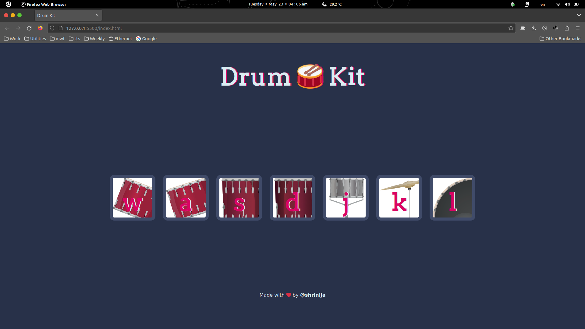

# Drum Kit Website

This is a Drum Kit website where users can play drums by clicking on the tiles. It is built using HTML, CSS, and JavaScript.



## How to Play

1. Visit the [Drum Kit Website](https://prajesheleven.github.io/drum-kit/).
2. Click on the drum tiles to play different drum sounds.
3. Enjoy creating your own drum beats!

## Technologies Used

- HTML
- CSS
- JavaScript

## Getting Started

To get a local copy of the project up and running, follow these steps:

1. Clone the repository:

   ```bash
   git clone https://github.com/your-username/drum-kit.git
   ```

2. Navigate to the project directory:

   ```bash
   cd drum-kit
   ```

- Open the index.html file in your web browser.

## Features

- Interactive drum tiles that play different drum sounds.
- Responsive design for optimal viewing on various devices.
- Simple and intuitive user interface.

## Contributing

Contributions are welcome! If you would like to contribute to this project, please follow these steps:

- Fork the repository.
- Create a new branch for your contribution.
- Make your changes and test them thoroughly.
- Submit a pull request explaining the changes you have made.

## Author

- [@shrinija](https://github.com/shrinija)
